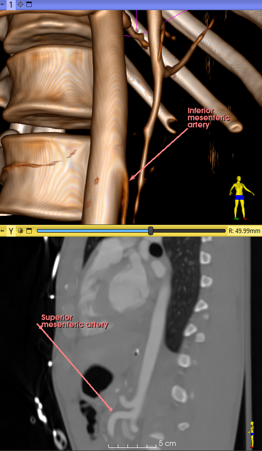

# Label

Create a markups node for annotation in a view.

A single point is handy to annotate a view for screen capture. The control point itself is not displayed in this case. Hovering the mouse pointer at the lower left corner of the annotation activates the control point, becoming thus visible and movable. In slice views, the annotation is visible if the control point is on the slice. In 3D views, the control points are not displayed, but can be activated and moved with the mouse.

With 2 control points, a line connects the control points which are presented as arrows oriented from the first to the second one.

The text label

 - can be multi-line,
 - is always positioned at the first control point,
 - is editable in the Markups module.

In a 3D view, the arrow tip dimension can be

 - proportional to the view's zooming level
 - proportional to the length of the arrow (3%)
 - fixed to a base radius of 1 mm.

Alternate colours are used by default. This can be overridden by registering a default node in the application startup file: the 'UseAlternateColors' property must set to an empty string.

## Disclaimer

Use at your own risks.

