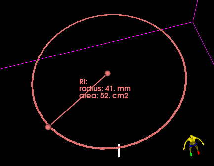

# ExtraMarkups

Create a derived markups that draws a ring using a base markup line.

This custom markups uses a base markups line to draw a ring in 2 modes.

1. The first control point of the base line is the center of the ring, and the
line's length is its radius.
2. Both control points of the base line lie on the circumference of the ring.
The line's length is its diameter.

