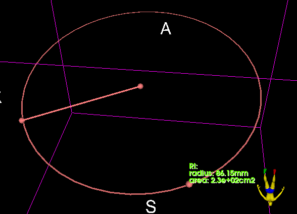

# ExtraMarkups

Create a markups node that draws a ring with three points.

The ring is built in two modes :

1. The first control point is the center of the ring, and the second point lies on the circumference.
2. Both control points lie on the circumference of the ring.

Radius is measured, as well as the resulting surface area.

N.B. - Use at your own risks.

