# Shape

Draw primitive shapes with control points.

These can be placed in the slice or 3D views. Shape geometry and actions are available in the Markups module's widget.

In the slice views, the shape is drawn as cut by the slice (intersection) or it is projected on the slice.

A specified slice view may be reformatted to fit the control points, to simplify point repositioning.

Alternate colours are used by default. This can be overridden by registering a default node in the application startup file: the 'UseAlternateColors' property must set to an empty string.

**Ring**

Here, in the 'Centered' radius mode, the centre is fixed when the circumferential points are moved. In the 'Circumferential' radius mode, all points are on the circumference and the centre is recalculated as the circumferential points are moved.

**Disk**

**Sphere**

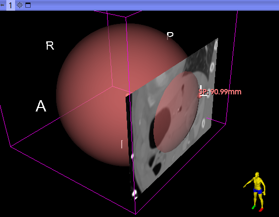

**Tube**

Here the points are treated in pairs, for drawing, point removal and reslicing. The latter operates on the last clicked point.

These helper [videos](https://disk.yandex.com/d/1lRilHh997rksw) illustrate different ways of placing control points to the best estimate of an arterial wall.

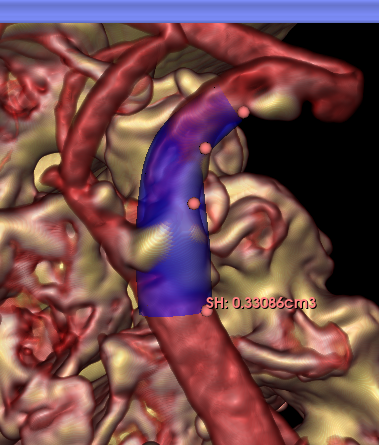

**Cone**

**Cylinder**

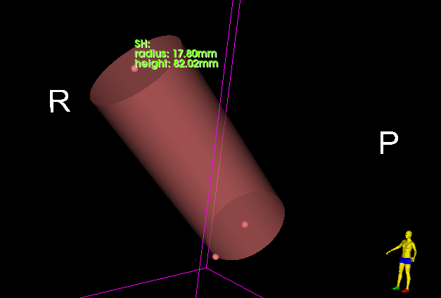

**Arc**

Here, in the 'Centered' radius mode, the centre is fixed when the circumferential points are moved. In the 'Circumferential' radius mode, the centre is recalculated as the circumferential points are moved. One control point always defines the centre.

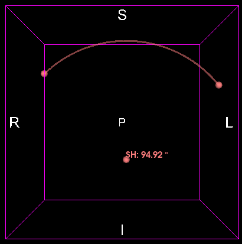

---

## Parametric shapes

This subset of geometric shapes derives from the VTK library. Here they all require 4 control points, and can be updated according to their UVW parameters.

**Ellipsoid**

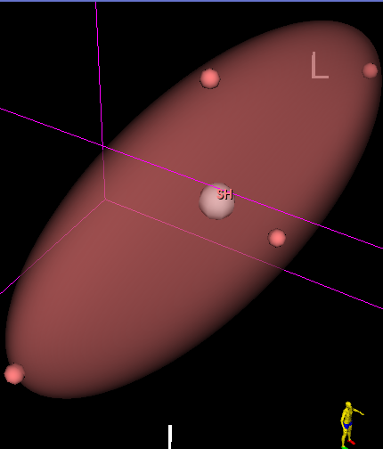

**Toroid**

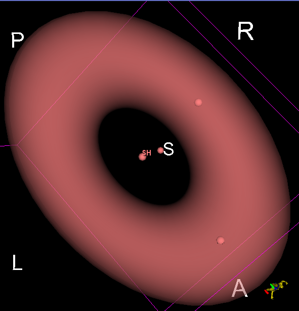

**BohemianDome**

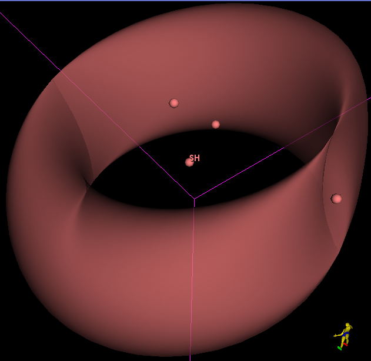

**Bour**

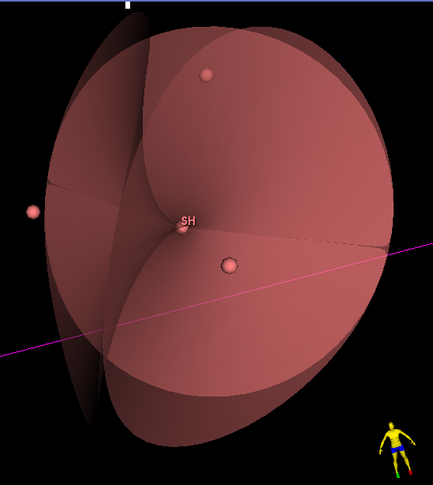

**Boy**

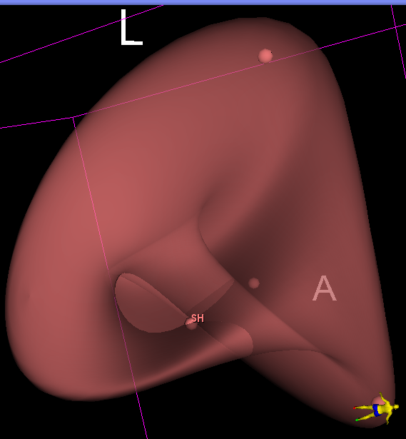

**ConicSpiral**

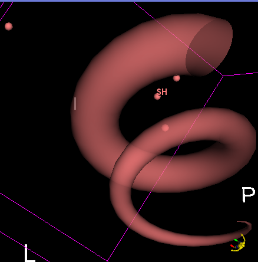

**CrossCap**

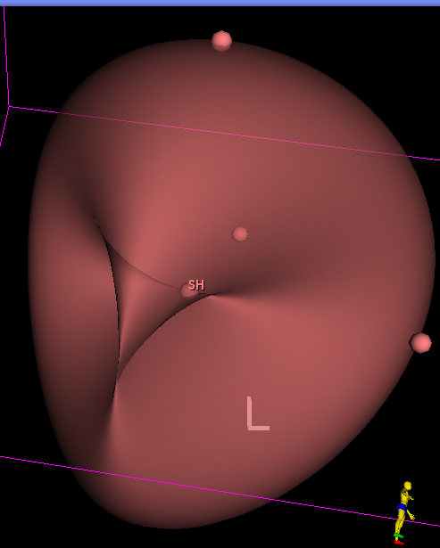

**Kuen**

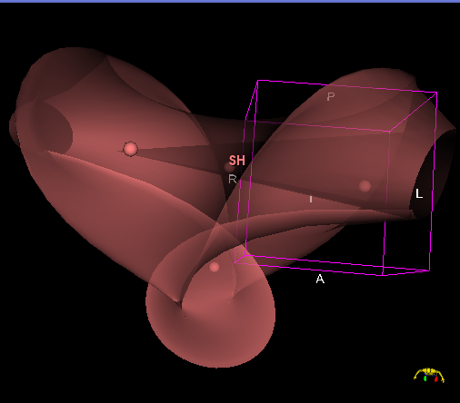

**Mobius**

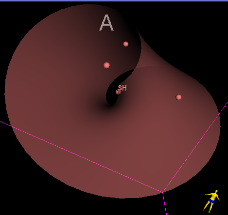

**PluckerConoid**

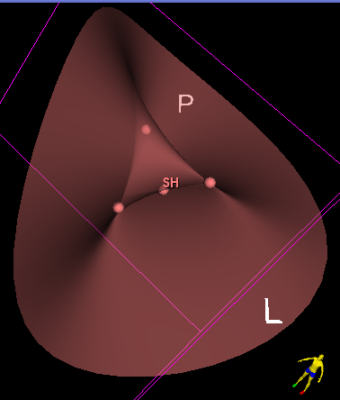

**Roman**

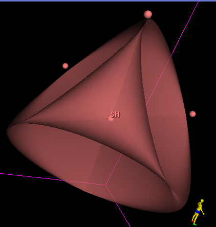

