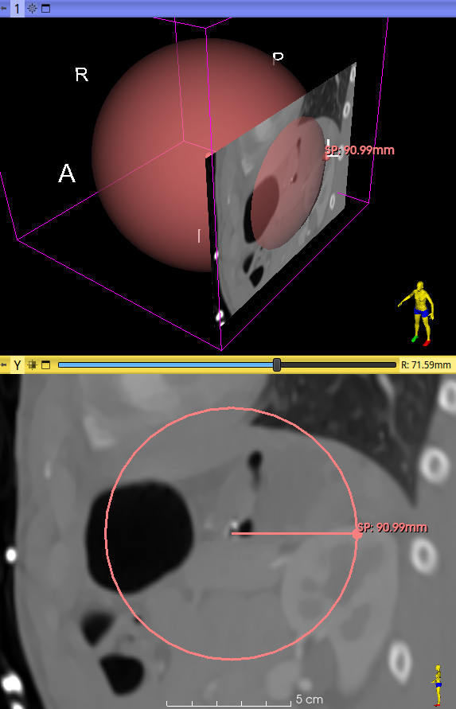

# Sphere

Create a markups node that draws a sphere with two points.

The sphere is built in two modes :

1. The first control point is the center of the sphere, and the second point lies on the circumference.
2. Both control points lie on the circumference of the sphere.

Radius is measured, as well as the resulting surface area and volume.

N.B. - Use at your own risks.

